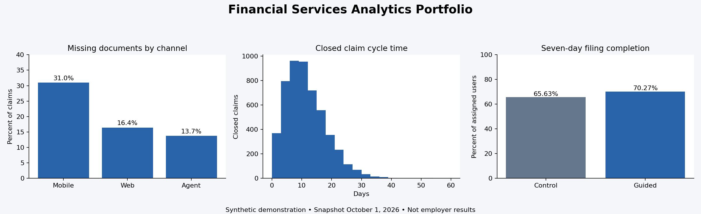

# Financial Services Risk and Product Analytics
**Author: Evans O. Ankrah** · SQL · SAS · Teradata · Snowflake · Databricks · Tableau · Python

A reproducible analytics portfolio built around the business questions in a Staff Data Analyst role: operational health, risk signals, product outcomes, and trustworthy metrics. All datasets and findings are synthetic. This project is independently created and is not affiliated with Assured, Discover, Capital One, or any insurer.



## View the dashboard
Open `dashboard/index.html` in a browser. Everything is embedded; no installation, server, login or internet needed. Select Claims operations, Risk review, or Filing experiment. Claims filters apply only to claims metrics. A Tableau counterpart can be built from `tableau/BUILD_GUIDE.md`.

## Reproduce
Python 3.10+; no third-party packages required for the core workflow.
```bash
python src/run.py
python -m unittest discover -s tests
# Optional dashboard logic check with Node.js:
node tests/validate_dashboard.cjs
```
Run from the repository root. Seed: 20261003. The runner regenerates inputs, runs the SQLite metric layer, exports dashboard sources, evaluates the experiment, and builds the standalone HTML dashboard. Output is deterministic; regenerating overwrites demonstration data and outputs.

## Projects
| Project | Business question | Evidence |
|---|---|---|
| Claims operations | Where do documentation gaps and delays occur? | 6,000 claims; segmentation; SLA; backlog; matured cohorts |
| Risk and control quality | Where does review capacity need attention? | 1,800 alerts; reviewed confirmation; aged queue; ingestion checks |
| Filing experiment | Does guided filing improve completion? | 8,000 randomized users; ITT lift; confidence interval; guardrails |

Read `docs/CASE_STUDIES.md` for results, proposed actions and limitations; `docs/METRICS.md` for denominators and eligibility; `docs/DATA_DICTIONARY.md` for fields; `docs/PLATFORM_GUIDE.md` for honest execution status. This is analytics and experimentation, not a fraud prediction model.

## Repository map
- `src/`: Python generator, SQL runner, statistical analysis, dashboard generation
- `data/curated/`: claims, alerts, filing experiment CSVs
- `data/raw/`: deliberately defective ingestion sample
- `sql/`: SQLite implementation and warehouse adaptations
- `sas/`: SAS ingestion, aggregates and exports
- `outputs/`: Tableau-ready CSVs and summary JSON
- `dashboard/`: HTML template and complete offline dashboard
- `tableau/`: dashboard construction and calculation guide
- `tests/`: analytical fixture tests
- `.github/workflows/`: reproducibility checks on pushes and PRs

## Use this portfolio in Work_files
This project lives in `eoankrah/Work_files` under `financial-risk-analytics-portfolio/`.
Clone or download the repository, enter this project folder, and run the reproduction commands above. Open `dashboard/index.html` locally for the full interactive dashboard. GitHub displays the source of HTML files rather than executing them.

## Validation limits
Python/SQLite executed locally. SAS and warehouse files are adaptations, not claimed live-platform runs. Tableau assets are sources and a build guide, not a tested native workbook. Experiment results are intentionally simulated and must not be presented as historical employment achievements.
